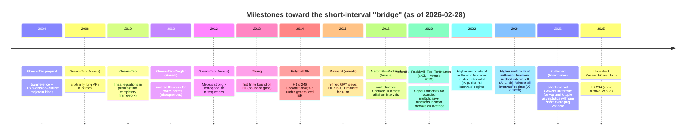
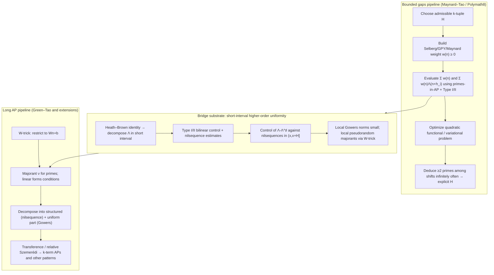

# Short-interval higher-order uniformity as a bridge between bounded prime gaps and long prime progressions

## Executive summary

The Maynard–Tao bounded-gaps program and the Green–Tao long-arithmetic-progressions program attack *different correlation regimes* of the primes. Bounded gaps are driven by **two-point / second-moment** detection: one optimizes nonnegative Selberg/GPY/Maynard sieve weights to force at least two primes among a finite admissible set of shifts, with the main analytic input being **distribution of primes in arithmetic progressions** at (or beyond) Bombieri–Vinogradov strength. citeturn3search0turn1search16turn0search0

Long arithmetic progressions (and, more broadly, many finite-complexity linear systems in primes) are **k-point / higher-order uniformity** problems: they require control of multilinear averages of the prime indicator. Green–Tao’s method uses the **W-trick**, a **pseudorandom majorant**, **transference** (relative Szemerédi), and the structure theory of higher Gowers norms via **nilsequences** and inverse theorems. citeturn3search1turn3search2turn6search7turn3search3

The most promising modern “bridge” between these worlds is now a *specific, technical frontier*: **short-interval higher-order uniformity** for arithmetic functions—especially the von Mangoldt function—measured against nilsequences and expressed via **local Gowers norms**. This line, developed by entity["people","Kaisa Matomäki","number theorist"] and entity["people","Maksym Radziwiłł","number theorist"] and collaborators, culminates in results that control nilsequence correlations and Gowers uniformity of (normalized) von Mangoldt in intervals \((x,x+H]\) for wide ranges of \(H\), including “almost all intervals” down to \(H \ge X^{1/3+\varepsilon}\), and applications that resemble **Hardy–Littlewood k-tuple asymptotics with a short average over one variable**. citeturn5view0turn5view1turn10view0

Conceptually, this frontier is compelling because it is simultaneously:
- **sieve-native** (its proofs use Heath–Brown identities, Type I/II sums, bilinear structures—core sieve technology), and
- **nilsequence-native** (it treats the true higher-order obstructions identified by Gowers inverse theorems and Möbius–nilsequence orthogonality). citeturn10view0turn6search7turn3search3

Analytically, it suggests concrete paths for progress that are neither “pure sieve” nor “pure transference,” but instead aim to import **local higher-order pseudorandomness** into the evaluation/optimization of sieve weights and into localized prime-pattern counting. citeturn1search2turn10view0turn9search2

Quantitatively, the best fully verified unconditional bound for bounded gaps remains \(H_1 \le 246\) from entity["organization","D. H. J. Polymath","polymath collaboration"] (Polymath8b). citeturn0search0turn12view0 A 2025 ResearchGate manuscript claims \(H \le 234\), but it does not appear (from the evidence located here) in a standard archival venue like arXiv or a peer-reviewed journal; it should be treated as **unverified**. citeturn13search0

## Programs, correlation order, and toolchains

### Core goals

**Bounded gaps (Maynard–Tao / Polymath8 lineage).** Show \(\liminf (p_{n+1}-p_n)\) is finite, and shrink explicit bounds. The foundational breakthroughs are due to entity["people","Yitang Zhang","number theorist"] (first explicit finiteness \(<7\times 10^7\)) and entity["people","James Maynard","number theorist"] (new sieve refinement implying \(\liminf(p_{n+m}-p_n)<\infty\) for all \(m\), and \(H_1\le 600\)); Polymath8b later achieved \(H_1\le 246\) unconditionally. citeturn1search16turn3search0turn0search0turn0search3

**Long arithmetic progressions (Green–Tao).** Prove primes contain arbitrarily long arithmetic progressions; more broadly, derive asymptotics for many linear systems in primes (finite complexity, non-degeneracy). This requires a transference framework and higher-order uniformity control (nilsequences). citeturn3search1turn3search2turn6search7

### Correlation order and what is actually being controlled

A helpful formal distinction is the *order of correlation* needed to close the main estimates.

- **Bounded gaps:** essentially **two-point / second-moment** detection. Even though one chooses a \(k\)-tuple of shifts \(\mathcal H\), the analytic core is a quadratic optimization of weights and evaluation of sums involving \(\Lambda(n)\) (or \(\theta(n)\)) along shifts—controlled primarily by prime distribution in arithmetic progressions and bilinear/Type I/II estimates. citeturn3search0turn1search16turn9search2

- **Long APs:** truly **k-point / higher-order**. Counting \(k\)-term APs involves \(k\)-fold products \(f(n)f(n+d)\cdots f(n+(k-1)d)\), governed by Gowers \(U^{k-1}\) norms. Large Gowers norms correspond to correlations with structured objects (nilsequences), by inverse theorems. citeturn3search1turn6search7turn6search1

### Comparison table

| Attribute | Bounded gaps (Maynard–Tao / Polymath8b) | Long APs / linear patterns (Green–Tao and beyond) |
|---|---|---|
| Problem | Infinitely often \(p_{n+1}-p_n \le H\); optimize \(H\). citeturn0search0turn3search0 | Existence of \(k\)-term APs for all \(k\); asymptotics for many linear systems. citeturn3search1turn3search2 |
| Correlation order | 2-point (second-moment) core, despite many shifts. citeturn3search0 | \(k\)-point; controlled by \(U^{k-1}\) norms and nilsequence obstructions. citeturn6search7turn6search1 |
| Main tools | Selberg/GPY/Maynard sieve weights; admissible tuples; BV-type distribution; Type I/II sums. citeturn3search0turn0search0 | W-trick; pseudorandom majorant; transference/relative Szemerédi; Gowers norms; nilsequences; inverse theorems. citeturn3search1turn6search7 |
| Typical analytic inputs | Bombieri–Vinogradov and refinements; stronger distribution inputs improve constants. citeturn1search16turn3search0 | Möbius–nilsequence orthogonality; inverse theorems; nilsequence equidistribution; majorant linear forms estimates. citeturn3search3turn6search7 |
| Representative unconditional quantitative bounds | Zhang: \(H_1 < 7\times 10^7\). citeturn1search16 Maynard: \(H_1\le 600\). citeturn3search0 Polymath8b: \(H_1\le 246\). citeturn0search0 | Green–Tao: APs of all lengths (qualitative). citeturn3search1 Short-interval quantitative pattern counts now exist (see below). citeturn5view0turn10view0 |
| Conditional benchmarks | Under GEH: Polymath8b gets \(H_1\le 6\). citeturn0search0 Under EH: Maynard notes strong improvements (e.g. \(H_1\le 12\)). citeturn11search0 | Many results unconditional after GI(s) and Möbius–nilsequence theorems; quantitative dependence remains huge. citeturn6search7turn6search1 |
| Open problems | Twin primes \(H_1=2\); parity barriers; turn “bounded gap exists” into “specific gap occurs infinitely often.” citeturn0search0turn3search0 | Effective quantitative bounds; extend local uniformity to much shorter intervals; treat more degenerate systems. citeturn10view0turn6search1 |

## Milestones and the emergence of the short-interval bridge

### Mermaid timeline of key milestones

The core message of this trajectory is that “short-interval uniformity” progressed in layers:
1. cancellation for multiplicative functions in almost all short intervals; citeturn8search0  
2. higher-order (nilsequence/Gowers) uniformity for bounded multiplicative functions on average; citeturn0search2turn0search6  
3. higher-order uniformity for von Mangoldt itself (after subtracting a structured approximant), first in a relatively long “all intervals” regime, then in an “almost all intervals” regime reaching \(H \ge X^{1/3+\varepsilon}\), with explicit k-tuple-type applications. citeturn5view0turn5view1turn10view0  

This is precisely the bridge zone: it treats \(\Lambda\) with tools that look simultaneously like sieve (Type I/II) and like higher-order Fourier analysis (nilsequences).

## The short-interval higher-order uniformity frontier

### The “average” and “almost all” regimes for higher-order uniformity

The 2023 Annals paper by Matomäki–Radziwiłł–Tao–Teräväinen–Ziegler proves that for large \(X\) and \(H\) in the range \(X^\theta \le H \le X\) (for any fixed \(\theta>0\)), one has **on average over \(x\in[X,2X]\)** strong cancellations of non-pretentious \(1\)-bounded multiplicative functions against polynomial phases and even **nilsequences**, and correspondingly small local Gowers norms. citeturn0search6turn0search2

This is already philosophically aligned with Green–Tao: “structured obstructions are nilsequences; if you beat them, you have uniformity.” The gap was that this result is for *bounded multiplicative functions* (e.g. Liouville), not \(\Lambda\).

That gap is narrowed by the “Higher uniformity of arithmetic functions in short intervals” series:

- **Part I (All intervals).** For intervals \((X,X+H]\) with \(H\) in a range \(X^{\theta+\varepsilon} \le H \le X^{1-\varepsilon}\), it studies higher uniformity of \(\mu\), \(\Lambda\), and divisor functions \(d_k\), by subtracting structured approximants \(\Lambda^\sharp, d_k^\sharp\) (and \(\mu^\sharp=0\)) and showing the difference has small nilsequence correlations and hence small local Gowers norms in certain regimes (notably \(\theta=5/8\) for \(f\in\{\Lambda,\mu,d_k\}\) as an example in the abstract). citeturn5view0

- **Part II (Almost all intervals).** For *almost all* \(x\in[X,2X]\), it controls nilsequence correlations of \(\Lambda-\Lambda^\sharp\) in intervals \((x,x+H]\) for significantly shorter \(H\), with the abstract highlighting \(H \ge X^{1/3+\varepsilon}\) for \(\Lambda\) (and even \(H \ge X^\varepsilon\) for divisor functions with appropriate normalization). citeturn5view1

The 2026 published Inventiones version makes this “bridge” even more explicit: it states short-interval **Gowers uniformity estimates** (Theorem 1.3) and then derives an **\(\ell\)-point Hardy–Littlewood asymptotic with only one averaging variable short-averaged** (Theorem 1.5), valid for a density \(1-o(1)\) of shifts \(h\le H\) when \(H \ge X^{1/3+\varepsilon}\). citeturn10view0

### Why this is a *bridge* to bounded gaps (not merely a Green–Tao refinement)

The bounded-gaps sieve needs to evaluate weighted sums of the form
\[
\sum_{n\in I} w(n)\Lambda(n+h_i)
\quad \text{and} \quad
\sum_{n\in I} w(n),
\]
often with \(I=[x,2x]\) in the classical global setting. What makes the short-interval bridge plausible is that the Part I/II program for \(\Lambda\) is **built from the same analytic primitives** that appear when controlling sieve weights:
- Heath–Brown identities / decompositions of \(\Lambda\) into convolutions;  
- Type I / Type II bilinear sums;  
- distributional control against structured objects. citeturn10view0turn5view0

Part II describes new tools—e.g. a “nilsequence contagion lemma” to scale up control from smaller to larger scales—precisely the kind of device that could, in principle, interface with **well-factorable-weight distribution theorems** central to modern improvements of distribution beyond \(x^{1/2}\). citeturn5view1turn10view0turn9search2

### Representative theorems and quantitative bounds you can “hang your hat on”

**Bounded gaps (verified):**
- Zhang: \(\liminf (p_{n+1}-p_n) < 7\times 10^7\). citeturn1search16  
- Maynard: refinement of GPY; in particular \(H_1\le 600\) and \(H_m<\infty\) for all \(m\). citeturn3search0  
- Polymath8b: \(H_1\le 246\) unconditionally, and \(H_1\le 6\) under generalized Elliott–Halberstam. citeturn0search0turn12view0  

**Unverified bounded-gap claim (flagged):**
- A 2025 ResearchGate upload claims \(H\le 234\) via a new “weighted distribution” framework, but it is not located in an archival venue here; treat as unverified. citeturn13search0

**Long APs and the higher-order framework (verified):**
- Green–Tao: primes contain arbitrarily long arithmetic progressions (Annals 2008). citeturn3search1  
- Inverse theorem for Gowers norms: large \(U^{s+1}\) implies correlation with an \(s\)-step nilsequence (Annals 2012), with later quantitative refinements. citeturn6search7turn6search1  
- Möbius strongly orthogonal to nilsequences (Annals 2012). citeturn3search3  

**Short-interval higher-order uniformity (the bridge):**
- “Higher uniformity … on average” for bounded multiplicative functions in short intervals (Annals 2023). citeturn0search2turn0search6  
- “Higher uniformity of arithmetic functions in short intervals I” (Forum of Mathematics, Pi 2023; arXiv v4 2024): nilsequence correlation bounds for \(\Lambda-\Lambda^\sharp\) in deterministic \((X,X+H]\) with \(H\) as low as \(X^{5/8+\varepsilon}\) in the exemplar regime, yielding short-interval linear-equation counts in primes. citeturn5view0  
- “Higher uniformity … II / Inventiones 2026”: for almost all intervals and \(H \ge X^{1/3+\varepsilon}\), establishes Gowers uniformity for (normalized) von Mangoldt after W-trick and derives \(\ell\)-point Hardy–Littlewood with one short averaging variable for most shifts \(h\le H\). citeturn10view0turn5view1  

This last item is the strongest current evidence that local higher-order uniformity is not just a philosophical bridge but a **technical conduit** from sieve decompositions to nilsequence control and then back to prime-pattern asymptotics.

## How the bridge could connect sieve optimization and nilsequence control

### Mermaid flowchart comparing method pipelines with the bridge highlighted

This picture encodes a precise hypothesis: the bridge becomes genuinely unifying if one can take the short-interval control (B3–B4) and use it to improve MT3 in regimes that matter for sieve optimization, while simultaneously allowing GT2–GT4 to be localized into short intervals with effective uniformity conditions.

### Why short-interval uniformity is particularly promising

Short intervals force both programs to confront the same bottlenecks:
- In bounded gaps, localizing to \([x,x+H]\) demands prime distribution and bilinear estimates with fewer averaging degrees of freedom; Alweiss–Luo’s \(\delta\ge 0.525\) threshold comes from the best known *uniform* prime number theorem technology in such lengths. citeturn1search2  
- In Green–Tao-type counting, localizing “pseudorandomness” requires local Gowers norms and nilsequence correlations of arithmetic functions; the Matomäki–Radziwiłł program provides exactly these estimates (first for multiplicative functions, now for \(\Lambda\)). citeturn8search0turn0search2turn10view0  

The Inventiones paper explicitly notes that quantifying these Gowers bounds is delicate because it would require tracking the “nilsequence contagion” argument’s dependence on dimension and complexity, indicating a clear technical obstacle and a clear direction for sharpening. citeturn10view0

## Research directions prioritized on the bridge

The directions below are phrased as “analytic paths” rather than broad speculation. Each item states (1) feasibility, (2) partial results, (3) main obstacles, and (4) what new inputs would likely be required.

### Local Maynard sieve powered by short-interval uniformity of von Mangoldt

**Idea.** Replace the global interval \([x,2x]\) in Maynard’s method by short intervals \((x,x+H]\), and attempt to prove *dense* bounded-gap phenomena in most such intervals using the Matomäki–Radziwiłł–Shao–Tao–Teräväinen uniformity of \(\Lambda-\Lambda^\sharp\).

**Feasibility.** Moderately plausible in an “almost all intervals” sense. The bounded-gaps method already has a short-interval adaptation at exponent \(0.525\) (Alweiss–Luo), but that relies on (uniform) prime-density technology rather than higher-order uniformity. citeturn1search2 The new uniformity results reach \(H\ge X^{1/3+\varepsilon}\) for almost all intervals in the nilsequence/Gowers sense, which is substantially shorter. citeturn5view1turn10view0

**Known partial results.**
- Alweiss–Luo: for any \(\delta\in[0.525,1]\), there exist \(k,d\) such that \([x-x^\delta,x]\) contains \(\gg x^\delta/(\log x)^k\) pairs of consecutive primes with gap \(\le d\) for all sufficiently large \(x\). citeturn1search2  
- Inventiones 2026: for \(H\ge X^{1/3+\varepsilon}\), obtains k-tuple-type asymptotics with only one short averaging variable for most shifts \(h\le H\), which is “prime tuples on average over shifts” in a genuinely short range. citeturn10view0  

**Main obstacles.**
- Bounded gaps needs **positivity and existence** for explicit finite sets of shifts; the Inventiones-type results often give asymptotics for “most” shifts or “almost all” intervals. Bridging from averaged asymptotics to guaranteed existence in each interval is nontrivial and may reintroduce parity-type barriers. citeturn0search0turn10view0  
- The sieve weight \(w(n)\) is itself structured (divisor sums), and one must control correlations of \(\Lambda\) *with those weights* in short intervals. The uniformity statements in Part II control \(\Lambda-\Lambda^\sharp\) against nilsequences, which is powerful but not immediately tailored to arbitrary sieve weights. citeturn5view1turn10view0  

**Required new inputs.**
- **Effective nilsequence decompositions for sieve weights** (or a proof that the relevant class of Maynard weights can be reduced to combinations of nilsequence tests plus acceptable error).  
- Stronger **short-interval distribution in arithmetic progressions** for the moduli induced by the weight divisors, ideally with well-factorable structure.  
- Better quantitative control of inverse theorems (complexity dependence), to translate “uniform against nilsequences” into explicit error terms in weighted sums. citeturn6search1turn10view0  

**Plausibility + difficulty.** High conceptual plausibility; very hard technically. The “right” intermediate target is likely: *bounded gaps in almost all intervals of length \(X^{\theta}\) for some \(\theta<0.525\)*, rather than improving the global \(H_1\) bound immediately.

### Short-interval level of distribution for well-factorable weights as the interface layer

**Idea.** Use the “factorability” paradigm—central in distribution beyond the square-root barrier—to connect Maynard-style sieve evaluation with nilsequence-based control mechanisms in short intervals.

**Why this is on the bridge.** “Well-factorable” and “triply well-factorable” weights are exactly where modern distribution of primes in AP has exceeded \(x^{1/2}\), and these results are explicitly designed to feed sieve applications. citeturn9search2turn14search0turn14search1

**Known partial results.**
- Maynard (2020): primes in AP to moduli up to \(x^{3/5-\varepsilon}\) when summed with suitably well-factorable weights. citeturn9search2  
- Lichtman (2023): level of distribution \(66/107\approx 0.617\) using triply well-factorable weights, with conditional extension to \(5/8\) under Selberg eigenvalue conjecture. citeturn14search0  
- Pascadi (2025): unconditional equidistribution up to \(x^{5/8-o(1)}\) via triply well-factorable weights (and improvements for linear sieve weights), removing Selberg-eigenvalue dependence in earlier work. citeturn14search1  

These are not “short interval” results per se, but they represent the strongest current analytic control of primes against structured moduli weights, and therefore define the most realistic input channel to sieve optimization.

**Main obstacles.**
- Translating global mean-value theorems in AP to **short-interval** statements is delicate: short-interval AP distribution typically loses averaging power and requires distinct methods (zero-density bounds, short-interval dispersion, etc.).  
- The short-interval uniformity papers for \(\Lambda\) rely heavily on Type I/II estimates and nilsequence arguments; incorporating factorable weight distribution into that framework requires new hybrid bilinear forms technology (essentially “factorable Type II meets nilsequence contagion”). citeturn10view0turn9search2  

**Concrete analytic path.**
1. Prove a *short-interval* analogue of “primes in AP to large moduli with factorable weights,” at least averaged over \(x\in[X,2X]\).  
2. Use that to evaluate Maynard weights localized to \((x,x+H]\) with smaller \(H\), improving Alweiss–Luo-type thresholds or increasing the density of bounded gaps in short windows. citeturn1search2turn9search2turn10view0  

**Required new inputs.**
- Short-interval versions of the spectral large sieve bounds that underpin the best “beyond \(1/2\)” distribution results, with uniformity in the shift/interval parameter. citeturn14search0turn14search1  
- Mechanisms to fuse factorability with nilsequence-test amplification (potentially inspired by the Inventiones “contagion lemma” philosophy). citeturn10view0  

**Plausibility + difficulty.** Plausible but very high difficulty. This is probably the most realistic route by which the bridge could eventually feed back into improved bounded-gap constants, because it targets the exact bottleneck (distribution input) that controls sieve power.

### Local transference in short intervals using von Mangoldt uniformity

**Idea.** Use short-interval Gowers uniformity of \(\Lambda-\Lambda^\sharp\) (after W-trick normalization) to formulate and prove **short-interval transference** statements: within most intervals \((x,x+H]\), primes behave like a dense subset of a pseudorandom measure for purposes of counting finite-complexity configurations.

**Known partial results.**
- Part I already advertises asymptotic formulas for solutions to linear equations in primes in short intervals (within its \(H\) range), which is a direct “local Green–Tao-type” statement. citeturn5view0  
- The Inventiones paper’s Theorem 1.5 (“\(\ell\)-point Hardy–Littlewood with one averaging variable”) is essentially a local correlation estimate strong enough to underwrite generalized von Neumann arguments in short ranges. citeturn10view0  

**Main obstacles.**
- The local uniformity is proved relative to an approximant \(\Lambda^\sharp\) and after a W-trick normalization. Making the majorant pseudorandomness conditions *effective and configuration-stable* (uniform over the full family of linear forms needed for a given combinatorial theorem) is technically demanding. citeturn5view0turn10view0  
- Quantitative inverse theorems: while qualitative inverse theorems are established, quantitative dependencies remain enormous; some recent work improves these bounds but they are still very large, and the Inventiones paper itself flags dimension-dependence issues for quantification. citeturn6search1turn10view0  

**Concrete analytic path.**
- Target a “finite complexity, one-short-variable averaged” version of Green–Tao’s linear-forms framework in \((x,x+H]\), pushing \(H\) lower by improving Type II estimates and the nilsequence contagion machinery.  
- Extract explicit configuration counts: e.g., bounded-length APs entirely inside \((x,x+H]\) for most \(x\), with \(H=X^{\theta}\) and explicit \(\theta\) thresholds. citeturn10view0turn5view1turn5view0  

**Required new inputs.**
- Sharper Type II estimates for \(\Lambda\) in short intervals (the source of the \(1/3\) threshold in the “almost all” setting). citeturn5view1turn10view0  
- Better quantitative equidistribution for polynomial nilorbits with explicit complexity dependence (to stabilize error control across families of configurations). citeturn6search7turn6search1  

**Plausibility + difficulty.** High plausibility as a continuing program (it is already partially realized). Difficulty is concentrated in lowering the short-interval exponent and improving uniformity from “almost all” to “all” intervals.

## Computational experiments and prototypes for testing the bridge

The analytic theorems are asymptotic and often effective only at very large scales. Nonetheless, carefully designed computations can test *model fidelity* (sieve-majorant vs primes), *local correlation behavior*, and the practical meaning of “uniformity” proxies at accessible \(X\).

The experiments below are designed to be implementable with segmented sieves and FFT-based correlation calculations on \(X\) up to \(10^8\)–\(10^{10}\) depending on hardware. (Resource estimates assume an efficient segmented sieve and C/Julia/Rust-level performance.)

### Recommended experiments table

| Experiment | Purpose (bridge question) | Parameters to sweep | Data sources | Metrics | Expected outcome if “bridge is real” | Rough compute budget |
|---|---|---|---|---|---|---|
| Local \(U^2\) / Fourier uniformity of primes after W-trick | Does short-interval pseudorandomness look “sieve-like” locally? | \(X\in[10^7,10^9]\); \(H\in\{X^{0.25},X^{0.33},X^{0.5}\}\); \(W\in\{30,210\}\) | Segmented prime sieve | Max nontrivial Fourier coefficient of \(1_{\mathbb P}(Wn+b)-\text{mean}\) per window | Peaks dominated by finite-sieve coupling; decay as \(H\) grows; stabilization across residues | \(10^2\)–\(10^4\) windows; FFT per window (seconds–hours) |
| Local nilsequence proxy tests (polynomial phases) | Do prime-weighted sums cancel against low-degree phases in short windows? | Same \(X,H,W\); phases \(e(\alpha n)\), \(e(\alpha n^2)\) with \(\alpha\) rational grid | Primes; optionally Liouville/Möbius | \(\max_\alpha |\sum_{x<n\le x+H} (f(n)-f^\sharp(n))e(\alpha n^d)|\) | Cancellation improves with \(H\); behavior closer to MRRTTZ predictions for bounded mult. functions | Hours–days depending on grid size |
| Sieve-majorant fidelity in short intervals | Does a finite-sieve majorant predict short-interval pattern counts? | \(B\) ladder for “sieve depth”; \(H\) as above | Sieve survivors vs actual primes | Ratio of counts: (i) primes in \((x,x+H]\), (ii) prime pairs at gap \(\le d\), (iii) 3AP counts | Ratios approach 1 as sieve depth increases; residual deviations small and structured | Moderate (needs repeated sieving); days at \(X\sim 10^9\) |
| Maynard weight × local patterns (small k prototypes) | Are Maynard weights locally “uniform” against higher-order tests? | Choose small admissible tuples; vary truncation \(R\); localize to windows | Compute Maynard/GPY weight \(w(n)\) and primes | Compare \(\sum w(n)\Lambda(n+h_i)\) to model; test correlation of \(w(n)\) with polynomial phases | \(w(n)\) largely explained by multiplicative structure; residual correlation small after normalization | Heavy; best at \(X\le 10^8\) unless optimized |
| Short-interval bounded gaps frequency vs uniformity proxies | Does local uniformity predict where small gaps occur more/less than expected? | Many windows of fixed \(H\) | Primes | Small gap counts; correlate with (i) local Fourier peaks, (ii) local variance of Λ-approx residual | Weak-to-moderate correlation; if strong correlation exists, suggests exploitable structure | Cheap once primes computed |
| “One-short-variable averaged tuples” numerics | Mirror Theorem 1.5 empirically at finite scale | Fix \(\ell\); sample \(h\le H\) | Primes | Estimate \(\sum_{n\le X} \prod_{j=0}^{\ell-1} \Lambda(n+jh)\) vs singular series heuristic | Agreement improves with \(X\) and when averaging over \(h\); deviations mostly from small primes | Moderate–heavy (needs convolution tricks) |

### Prototype design notes (what to do, not code)

- Use a segmented sieve to generate primes in blocks and compute windowed statistics. For \(\Lambda\)-weighted sums, approximate \(\Lambda(n)\) by \(\log p\) on primes \(p\) and 0 otherwise; for more faithful modeling, include prime powers if desired.
- Implement W-trick by restricting to residue classes \(b\bmod W\) with \((b,W)=1\), and analyze the induced sequence in the \(n\)-variable.
- For nilsequence proxies at low step, polynomial phases \(e(\alpha n^d)\) are a computationally accessible stand-in; MRRTTZ explicitly links such phase tests to higher uniformity results and notes that nilsequences are the correct general obstruction class. citeturn0search6turn10view0

These experiments will not “verify theorems,” but can (i) validate modeling assumptions (finite-sieve majorant accuracy), (ii) expose which local deviations are fully sieve-explained, and (iii) highlight whether any residual structure correlates with known obstruction classes (polynomial/nilsequence types), which is exactly what the bridge claims should happen.

## Notes on bounded-gap status and the unverified \(H\le 234\) claim

The most authoritative, archival statement remains Polymath8b’s **unconditional** \(H_1\le 246\). citeturn0search0turn12view0

A 2025 ResearchGate manuscript by “Yuhang Shi” claims \(H\le 234\) via a new weighted distribution framework. Because it is not located here in arXiv/Annals/other standard archival venues, and because the bounded-gap record is widely tracked in those venues, it should be treated as **unverified until independently vetted**. citeturn13search0

In contrast, the short-interval higher-order uniformity results that define the bridge are available in major venues (Annals; Forum of Mathematics, Pi; Inventiones) and on arXiv, and are therefore the most reliable “modern frontier” anchor for research planning. citeturn0search2turn5view0turn10view0