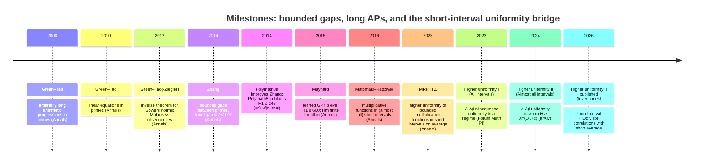
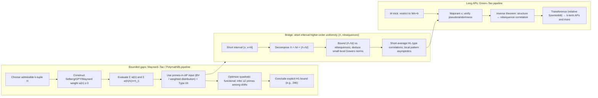

# Short-interval higher-order uniformity as a bridge between Maynard–Tao bounded gaps and Green–Tao long progressions  
**Report date:** 2026-02-28 (America/New_York)

## Executive summary

The entity["people","James Maynard","mathematician"]–entity["people","Terence Tao","mathematician"] bounded-gaps program and the entity["people","Ben Green","mathematician"]–Tao long-APs program probe **different correlation regimes** of the primes. Bounded gaps is essentially a **2-point / second-moment** detection problem: it optimizes a Selberg/GPY/Maynard weight to force **at least two primes among a fixed set of shifts**, relying primarily on **distribution of primes in arithmetic progressions** at (or beyond) Bombieri–Vinogradov strength. This program produced explicit unconditional bounds such as Zhang’s \(\liminf(p_{n+1}-p_n)<7\times 10^7\) and Polymath8b’s \(H_1\le 246\). citeturn0search0turn0search2

Green–Tao long-APs is a **k-point / higher-order** correlation problem: it counts configurations like \(n,n+d,\dots,n+(k-1)d\), which are controlled by **Gowers norms** \(U^{k-1}\). The structured obstructions are described by **nilsequences**, via inverse theorems, and the proof architecture uses the **W-trick**, a pseudorandom majorant, and **transference** (relative Szemerédi). citeturn0search3turn2search3

The most promising modern *technical* bridge between these worlds is now quite specific: **short-interval higher-order uniformity for arithmetic functions closely tied to primes (especially the von Mangoldt function \(\Lambda\))**, formulated as **nilsequence correlation bounds** and **local Gowers-uniformity bounds**. This line began with short-interval cancellation for multiplicative functions (Matomäki–Radziwiłł, Annals 2016) and culminated in:

- **Higher uniformity of bounded multiplicative functions in short intervals on average** (Annals 2023): nilsequence tests and \(U^{k+1}\)-uniformity on average for \(1\)-bounded multiplicative functions in windows \([x,x+H]\) with \(H\ge X^\theta\). citeturn1search0turn1search4  
- **Higher uniformity of arithmetic functions in short intervals I (All intervals)** (Forum of Mathematics, Pi 2023; arXiv 2022): for \((X,X+H]\) with \(H\ge X^{\theta+\varepsilon}\), show that \(\Lambda-\Lambda^\sharp\) (and analogues for \(d_k\)) has small nilsequence correlation in regimes such as \(\theta=5/8\) for \(\Lambda\); imply small local Gowers norms and yield prime-pattern asymptotics in short intervals. citeturn1search1turn2search5  
- **Higher uniformity…II (Almost all intervals)** (arXiv 2024; Inventiones 2026): for almost all \(x\in[X,2X]\) and **\(H\ge X^{1/3+\varepsilon}\)**, obtain uniform nilsequence correlation bounds for \(\Lambda-\Lambda^\sharp\), deduce small local Gowers norms, and prove Hardy–Littlewood-type correlation asymptotics with only one short averaging variable; new ingredient: a **nilsequence “contagion lemma.”** citeturn1search2turn2search0turn1search3

This “short-interval higher-order uniformity” frontier is compelling as a bridge because it is simultaneously **sieve-native** (Type I/II bilinear technology, \(\Lambda\)-identities) and **nilsequence-native** (the structured obstruction class required by Green–Tao). It offers concrete hybrid research objectives: make distribution-in-AP inputs compatible with short windows and with sieve weights (especially via **well-/triply-well-factorable weights**) and build an effective “structure vs uniformity” interface for **Maynard-type weights**.

On quantitative bounds: the published Polymath8b constant remains **\(H_1\le 246\)** unconditionally and **\(H_1\le 6\)** under generalized Elliott–Halberstam. citeturn0search2turn3search5 A 2025 ResearchGate manuscript claims **\(H\le 234\)**, but it is **unverified** (not located here in an archival venue like arXiv or a refereed journal); it should be treated as provisional until independently vetted. citeturn3search2

## Goals and correlation order

### Core goals

**Bounded gaps (Maynard–Tao / Polymath8).** Let \(p_n\) be the \(n\)-th prime and \(H_1=\liminf_{n\to\infty}(p_{n+1}-p_n)\). The program proves \(H_1<\infty\) and optimizes upper bounds on \(H_1\); more generally, for \(m\ge 1\), \(H_m=\liminf_{n\to\infty}(p_{n+m}-p_n)\) is shown finite. citeturn0search2turn0search1

**Long arithmetic progressions (Green–Tao).** For each \(k\), prove primes contain \(k\)-term arithmetic progressions \(a,a+d,\dots,a+(k-1)d\). In extensions (“linear equations in primes”), obtain asymptotics for many finite-complexity systems of affine-linear forms taking prime values. citeturn0search3turn5search3

### Correlation order: why “2-point vs k-point” is the right comparison

A clean analytic lens is to view prime-pattern questions as controlling **products of shifted prime indicators** (or \(\Lambda\)-weights).

- **Bounded gaps: effectively 2-point / second-moment.** Maynard’s refinement of GPY constructs a nonnegative weight \(w(n)\) supported on integers \(n\) for which many of \(n+h_i\) are free of small prime divisors, and shows that a weighted expected number of primes among \(n+h_i\) exceeds a threshold, forcing existence of \(n\) with at least two primes among the shifts. This is a quadratic/second-moment optimization over weight coefficients, evaluated using distribution of primes in AP and Type I/II estimates. citeturn0search1turn0search2

- **Long APs: genuinely k-point / higher-order.** Counting \(k\)-term APs requires controlling averages like  
  \[
  \sum_{n,d} f(n)f(n+d)\cdots f(n+(k-1)d),
  \]
  which are governed by Gowers norms \(U^{k-1}\). Large \(U^{s+1}\) norm corresponds to correlation with an \(s\)-step nilsequence (inverse theorem), and Green–Tao transference requires showing the prime-weighted function is uniform enough against these obstructions after local factors are removed (W-trick). citeturn2search3turn0search3

**Why this matters for “bridging.”** A unification attempt must either:
1) upgrade sieve optimization to control higher-order correlations (hard), or  
2) upgrade higher-order uniformity to handle sieve-weighted tests (also hard).  
Short-interval higher-order uniformity is the first area where both upgrades are partially in scope, because it measures \(\Lambda\) locally in a language compatible with nilsequences while being proved using sieve-type bilinear methods. citeturn1search1turn1search2

## Toolchains and inputs

### Maynard–Tao / Polymath8 toolchain: Selberg/GPY/Maynard weights + AP distribution

**Sieve weights (Selberg / GPY / Maynard).** The core object is a nonnegative weight \(w(n)\), typically built from truncated divisor sums, designed to correlate with primes in the shifted set \(n+\mathcal H\). Maynard’s 2015 Annals paper explicitly “refines the GPY sieve method,” removing limitations and enabling strong bounds on \(H_1\) and finiteness of \(H_m\) for all \(m\). citeturn0search1turn0search2

**Distribution in arithmetic progressions (Bombieri–Vinogradov and variants).** Zhang’s 2014 breakthrough proves \(\liminf(p_{n+1}-p_n)<7\times 10^7\) using a strengthened Bombieri–Vinogradov theorem for certain moduli, cited as a “major ingredient” already in his abstract. citeturn0search0 Polymath8a optimized Zhang’s approach to \(H_1\le 4680\). citeturn3search5turn3search0

**Elliott–Halberstam variants.** Polymath8b reports conditional bounds such as \(H_1\le 12\) under Elliott–Halberstam (EH) (via Maynard’s analysis) and achieves \(H_1\le 6\) under generalized EH (GEH). citeturn0search2

**Parity barrier / sieve limitations.** Polymath8b explicitly frames a modified “parity problem” argument of Selberg to show quantitative limitations of purely sieve-theoretic methods, even after substantial optimization. citeturn0search2

### Green–Tao toolchain: W-trick + transference + Gowers/nilsequence structure theory

**W-trick.** Factor out local congruence obstructions by restricting to residue classes \(b \bmod W\) with \((b,W)=1\), where \(W\) is the product of small primes. This stabilizes local densities and removes trivial periodic biases. (This is standard in Green–Tao and later linear-forms work.) citeturn0search3turn5search3

**Transference (relative Szemerédi).** Green–Tao’s 2008 paper emphasizes three ingredients: Szemerédi, a transference principle, and a pseudorandom majorant construction that allows primes (a sparse set) to be treated “as if dense” relative to a pseudorandom measure. citeturn0search3turn0search7

**Gowers norms and inverse theorems.** The obstruction class to uniformity is described by nilsequences: the Green–Tao–Ziegler inverse theorem states that if \(\|f\|_{U^{s+1}[N]}\) is large, then \(f\) correlates with a bounded-complexity \(s\)-step nilsequence. citeturn2search3turn2search7

**Möbius orthogonality to nilsequences.** Green–Tao prove \(\mu\) is strongly orthogonal to polynomial nilsequences, settling the Möbius and nilsequence conjecture and supplying the analytic number theory “randomness” side needed to control structured errors in linear-forms counting. citeturn2search2turn2search6

**Quantitative inverse theory.** Quantitative bounds are famously difficult; Manners provides a proof yielding explicit (double-exponential in parameters) quantitative bounds for inverse theorems over cyclic groups, reducing reliance on regularity or nonstandard analysis. citeturn4search3turn4search7

## Short-interval higher-order uniformity bridge

This section isolates why the short-interval higher-uniformity program is genuinely “bridge-shaped” rather than simply a refinement of either side.

### Foundational layer: short-interval cancellation for multiplicative functions

Matomäki–Radziwiłł (Annals 2016) relate short averages of multiplicative functions to long averages, yielding (among other consequences) cancellation for Möbius in almost all short intervals. This made “local randomness” durable enough to feed later uniformity and correlation problems. citeturn5search0

A second layer (Matomäki–Radziwiłł–Tao, 2018/Inventiones line) established local Fourier-uniformity on average for bounded multiplicative functions at scales \(H\ge X^\theta\) for arbitrarily small fixed \(\theta>0\). citeturn5search1

### MRRTTZ 2023: nilsequence tests and higher-order uniformity on average

In Annals 2023, MRRTTZ prove that for non-pretentious \(1\)-bounded multiplicative functions (including Liouville), polynomial-phase tests can be replaced by **degree-\(k\) nilsequence tests** over most short intervals \([x,x+H]\), and via inverse theory this implies averaged local Gowers-uniformity \(\int_X^{2X}\|\lambda\|_{U^{k+1}([x,x+H])}\,dx=o(X)\) for \(H\ge X^\theta\). citeturn1search0turn1search4

This is the first major “bridge” result because it uses analytic number theory to prove a statement whose natural language is **nilsequences/Gowers norms** (Green–Tao’s obstruction class), but at **short-interval scale**, which is exactly where “sieve weights and local distribution” matter for bounded gaps.

### 2022/2023 “Higher uniformity… I”: introducing \(\Lambda^\sharp\) and controlling \(\Lambda-\Lambda^\sharp\) in all short intervals (in a regime)

Part I (arXiv 2022; Forum of Mathematics, Pi 2023) moves from bounded multiplicative functions to archetypal arithmetic functions in prime problems: \(\mu\), \(\Lambda\), \(d_k\). The key move is to introduce structured approximants \(\Lambda^\sharp\), \(d_k^\sharp\) so that the residual \(f-f^\sharp\) is small against nilsequence tests. In the abstract, the authors state an illustrative regime: for \(\theta=5/8\) and \(f\in\{\Lambda,\mu,d_k\}\), one has  
\[
\sum_{X<n\le X+H} (f(n)-f^\sharp(n))F(g(n)\Gamma)\ \ll\ H\log^{-A}X
\]
for any fixed \(A>0\), and hence small local Gowers norms. citeturn1search1turn2search5

Crucially for the bridge, the paper emphasizes that proving such nilsequence correlation bounds requires controlling **Type II sums** using **multi-parameter nilsequence equidistribution** and controlling certain Type I\(_2\) sums by decomposing neighborhoods of hyperbolae into arithmetic progressions. Those are sieve-native technical forms expressed in nilsequence language. citeturn1search1turn1search9

### 2024/2026 “Higher uniformity… II”: almost-all intervals, exponent \(1/3\), and Hardy–Littlewood with one short average variable

Part II (arXiv 2024; Inventiones 2026) strengthens the local statement dramatically by proving it for **almost all** starting points \(x\in[X,2X]\) and pushing the Λ-range to \(H\ge X^{1/3+\varepsilon}\). The arXiv abstract states that for almost all \(x\), and any filtered nilmanifold \(G/\Gamma\), Lipschitz \(F\), one has a uniform bound  
\[
\sup_{g\in \mathrm{Poly}(\mathbb Z\to G)} \left|\sum_{x<n\le x+H}(\Lambda(n)-\Lambda^\sharp(n))\overline{F}(g(n)\Gamma)\right|\ \ll\ H\log^{-A}X,
\]
and deduces small local Gowers norms in the same range. It then uses these uniformity outputs to establish the Hardy–Littlewood conjecture and divisor-correlation conjecture **with a short average over one variable**. citeturn1search2turn2search0

A major new ingredient is a “contagion lemma” for nilsequences used to scale approximate functional equations up to larger scales; Tao’s blog post highlights sample applications such as Hardy–Littlewood asymptotics for APs of almost all steps \(h\sim X^{1/3+\varepsilon}\). citeturn1search2turn1search3

### Why this is the most promising bridge: a systems-level view

Bounded gaps needs to evaluate highly structured weighted sums of \(\Lambda\) (or \(\theta\)) where the weights come from Selberg/Maynard constructions; Green–Tao needs to show that after local factor removal (W-trick), the prime measure has small correlation with nilsequence obstructions at the required order. The short-interval higher-uniformity series effectively supplies a **local decomposition for \(\Lambda\)** into structured + uniform pieces, with “uniform” measured precisely by nilsequence/Gowers tests and proved by sieve-type bilinear analysis. citeturn1search1turn1search2

This is the closest existing object to a common interface layer between sieve optimization and nilsequence uniformity.

## Prioritized hybrid research directions

This section prioritizes short-interval uniformity as the bridging substrate and evaluates hybrid directions via: feasibility, known partial results, obstacles, analytic path, required new inputs, plausibility/difficulty.

### Localized Maynard sieve in short intervals below the \(0.525\) barrier

**Feasibility.** Medium in an “almost all intervals” sense; low for uniform “all intervals.” There is already a Maynard-type bounded-gap result in short intervals down to \(\delta\ge 0.525\) (Alweiss–Luo), based on combining short-interval prime density technology with Maynard’s method. citeturn5search2 The new Λ-uniformity to \(H\ge X^{1/3+\varepsilon}\) strongly suggests the possibility of pushing bounded-gap phenomena into shorter windows for almost all \(x\), but the interface with sieve weights is nontrivial. citeturn1search2turn2search0

**Known partial results.**
- **Bounded gaps in short intervals**: for any \(\delta\in[0.525,1]\) there exist \(k,d\) such that \([x-x^\delta,x]\) contains \(\gg x^\delta/(\log x)^k\) pairs of consecutive primes differing by at most \(d\). citeturn5search2  
- **Λ-uniformity almost everywhere**: for almost all \(x\), \(\Lambda-\Lambda^\sharp\) is nilsequence-uniform for \(H\ge X^{1/3+\varepsilon}\), enabling HL-type short-averaged correlation asymptotics. citeturn1search2turn2search0

**Main obstacles.**
1. **Weight–test mismatch:** Maynard weights expand into divisor/lcm sums over many moduli; Part II uniformity controls nilsequence tests, not automatically the full class of structured divisor-sum tests arising in sieve weights. citeturn0search1turn1search2  
2. **From averaged correlation to forced existence:** HL-type asymptotics “for most shifts” or “on average over \(x\)” do not directly imply the positivity inequalities needed to force ≥2 primes among a specific shift set in a specific interval. citeturn0search2turn1search2

**Concrete analytic path.**
- Express the localized Maynard objective in \((x,x+H]\) as a main term driven by \(\Lambda^\sharp\) plus an error term involving \(\Lambda-\Lambda^\sharp\).  
- Develop bounds for \(\sum_{x<n\le x+H} w(n)(\Lambda(n+h_i)-\Lambda^\sharp(n+h_i))\) for Maynard-type \(w\), either by decomposing \(w\) into bounded-complexity structured components (nilsequence-like) plus uniform remainder, or by proving that relevant expansions can be controlled by a factorable-weight distribution theorem in short intervals.  
- First target: prove “bounded gaps occur in almost all intervals of length \(X^\theta\)” for some \(\theta<0.525\), rather than improving global \(H_1\) immediately.

**Required new inputs.**
- A **structure theorem for sieve weights** or for key components in their expansions, compatible with nilsequence tests.  
- Quantitative complexity tracking (nilmanifold dimension/step/Lipschitz dependence) strong enough to survive sieve parameter sizes. citeturn2search0turn4search3

**Plausibility/difficulty.** High conceptual plausibility, very high technical difficulty; likely payoff is improved short-interval exponents (almost-all intervals) before any new global \(H_1\) constant.

### Short-interval distribution in AP with well-/triply-well-factorable weights

**Feasibility.** Medium for mean-value or averaged-over-\(x\) short-interval forms; low for uniform short-interval analogues. “Beyond \(1/2\)” level-of-distribution results for primes currently require well-/triply-well-factorable weights and sophisticated spectral large sieve input; transporting them into short windows would be a major advance. citeturn4search0turn4search2

**Known partial results.**
- Maynard proves mean value theorems for primes in AP to moduli as large as \(x^{3/5-\varepsilon}\) with well-factorable weights. citeturn4search0  
- Lichtman pushes level of distribution to \(66/107\approx0.617\) with triply well-factorable weights; conditional extension to \(5/8\). citeturn4search1turn4search5  
- Pascadi proves equidistribution up to \(x^{5/8-o(1)}\) using triply well-factorable weights unconditionally, removing Selberg-eigenvalue dependence in earlier works. citeturn4search2turn4search6

**Main obstacles.**
1. **Short interval dispersion:** AP distribution proofs use smoothing and averaging that are harder in \((x,x+H]\).  
2. **Compatibility with nilsequence scaling:** combining short-interval “contagion”-type scaling of nilsequence uniformity with factorable-weight AP distribution requires a new hybrid bilinear/spectral interface.

**Concrete analytic path.**
- Prove a short-interval analogue of “primes in AP to large moduli with factorable weights,” initially averaged over \(x\in[X,2X]\) (mirroring MRRTTZ-style averaging).  
- Feed this into localized Maynard weights to improve short-interval bounded-gap densities and perhaps to sharpen constants in the “bounded gaps in short intervals” direction.

**Required new inputs.**
- A short-interval spectral large sieve (or dispersion) mechanism uniform enough in \(x\) to keep track of factorability.  
- A way to integrate “factorability” with the nilsequence contagion framework to avoid complexity blowup. citeturn1search2turn4search2

**Plausibility/difficulty.** Plausible but extremely difficult; arguably the most direct path by which the short-interval bridge could eventually improve global bounded-gap constants, because it attacks the main bottleneck input.

### Effective nilsequence decomposition for Selberg/Maynard weights

**Feasibility.** Medium-to-low. This is a “missing interface” problem: sieve weights are highly structured multiplicative objects; nilsequence decomposition is additive-structure language. But the short-interval higher-uniformity papers already show how sieve-native Type I/II forms can be controlled via nilsequence equidistribution, suggesting that at least some sieve-weight components may be expressible in bounded-complexity structured forms. citeturn1search1turn1search2

**Known partial results.**
- Inverse theorems precisely characterize obstructions to Gowers uniformity as nilsequence correlations. citeturn2search3  
- “Higher uniformity… I/II” show that for \(\Lambda\), a structured approximant \(\Lambda^\sharp\) captures the main structured component; the residual is nilsequence-uniform. citeturn1search1turn1search2

**Main obstacles.**
1. **Complexity explosion in sieve expansions:** Maynard weights involve sums over many divisors; naive structured approximations can have complexity growing too fast.  
2. **Quantitative inverse theory limits:** even with Manners-style bounds, tracking parameters through multiple decompositions can be prohibitive.

**Concrete analytic path.**
- Restrict attention to **factorable** variants of sieve weights (where coefficient structure is constrained), and attempt to build an explicit \(w^\sharp\) capturing the “structured part,” analogous to \(\Lambda^\sharp\).  
- Prove that the remainder correlates weakly with nilsequences in short intervals, allowing \(\Lambda-\Lambda^\sharp\) bounds to be applied in weighted contexts.

**Required new inputs.**
- A robust “structured approximant” theory for sieve weights (what \(\Lambda^\sharp\) is to \(\Lambda\)).  
- Quantitative nilsequence equidistribution bounds uniform in parameters relevant to weights. citeturn2search0turn4search3

**Plausibility/difficulty.** Speculative, hard, but potentially valuable as an interface foundation for multiple hybrid directions.

### Local transference theorems for patterns in primes inside \((x,x+H]\)

**Feasibility.** High for “almost all \(x\)” results at current exponents; medium for pushing exponents lower; low for uniform “all \(x\).” Part I already produces short-interval prime-pattern asymptotics in its regime, and Part II strengthens to HL-type correlation with short averaging. citeturn1search1turn1search2

**Known partial results.**
- Part I: asymptotic formula for solutions to linear equations in primes in short intervals (within the stated regime). citeturn1search1turn2search5  
- Part II / Inventiones: HL and divisor correlation conjectures with a short average over one variable; Tao’s blog emphasizes AP applications with steps \(h\sim X^{1/3+\varepsilon}\) for almost all \(h\). citeturn2search0turn1search3

**Main obstacles.**
- Quantitative dependence on nilmanifold complexity and step \(s\), explicitly flagged as delicate to quantify (and a natural target for improvement). citeturn2search0turn4search3  
- Lowering the \(1/3\) threshold for Λ-uniformity likely requires new Type II bilinear innovations beyond current technology.

**Concrete analytic path.**
- Fix a configuration family (e.g., \(k\)-term APs for fixed \(k\)) and sharpen “almost all steps” results to “pattern existence in almost all intervals,” using stronger local transference arguments tied directly to the Part II nilsequence-uniformity bounds.  
- Pursue incremental reductions of the Λ threshold exponent.

**Required new inputs.**
- Improved short-interval Type II estimates for Λ against nilsequence tests; improved quantitative control over the contagion lemma’s parameter dependence. citeturn1search2turn2search0

**Plausibility/difficulty.** Plausible and active; hardest part is lowering exponents and strengthening “almost all” to more uniform statements.

## Computational experiments and prototypes

These experiments are designed to test the *bridge heuristics* empirically: whether short-interval behavior of primes is largely explained by sieve-majorant structures and whether residuals align with the nilsequence/polynomial-phase obstruction class.

| Experiment | Goal | Suggested parameters | Data source | Metrics | Expected outcome | Resource estimate |
|---|---|---|---|---|---|---|
| Windowed sieve-majorant fidelity | Test whether finite-sieve models explain local deviations in prime counts and small gaps | \(X\) up to \(10^8\)–\(10^9\); window length \(H=X^\theta\) for \(\theta\in\{0.33,0.4,0.5\}\); W-trick with \(W\in\{30,210\}\); sieve depth \(B\) ladder (31,101,317,1009,…) | Segmented prime sieve; W-coprime candidate list; finite-sieve survivors | Ratios in each window: prime count / model count; gap≤d frequency / model; variance across windows | Ratios stabilize toward 1 as \(B\) increases; remaining variance decreases with larger \(H\) and after W-trick | Moderate: hours–days depending on \(X\) and number of windows |
| Local Fourier / \(U^2\) diagnostics after W-trick | Check whether residual periodic bias beyond W-trick is sieve-explained | Same \(X,H,W\); also small moduli \(q\le Q\) (e.g., \(Q\sim 10^4\)) | Primes in windows | Max nontrivial Fourier coefficient of mean-centered indicator in each residue class; discrepancy over moduli \(q\) | Peaks mostly explained by finite-sieve coupling; residuals behave like noise at scale \(H\) | Moderate: FFT per window; hours for thousands of windows |
| Polynomial-phase proxy for nilsequence correlation | Test cancellation against low-degree phases as a proxy for nilsequence tests | Same windows; phases \(e(\alpha n)\), \(e(\alpha n^2)\) with α on coarse rational grid; compare before/after subtracting sieve majorant | Primes / \(\Lambda\) approximation | \(\max_{\alpha\in\mathcal A}\left|\sum_{x<n\le x+H} (\Lambda(n)-\Lambda_{\text{model}}(n)) e(\alpha n^2)\right|\) | After subtracting a reasonable majorant, remaining correlations shrink with \(H\); no persistent large peaks | Moderate: choose small \(|\mathcal A|\) initially |
| Local Maynard-weight prototypes | Test whether Maynard weights interact with short-interval uniformity predictions | Small admissible tuples; truncation \(R\); windows \(H=X^\theta\) | Compute approximate Maynard/GPY weights \(w(n)\) | Compare \(\sum w(n)\Lambda(n+h_i)\) to model; check if residual obeys uniformity-like decay across windows | Main term dominated by local factors/sieve; residual smaller and more stable after W-trick | Heavy: computing weights dominates; start at \(X\le 10^8\) |
| “One short average variable” tuple counts | Empirically mirror Part II’s “short-average Hardy–Littlewood” flavor | Fix \(\ell\) (3–5); sample many \(h\le H\) | Primes / \(\Lambda\) approximation | Average over \(h\): \(\sum_{n\in(x,x+H]} \prod_{j=0}^{\ell-1}\Lambda(n+jh)\) vs estimated singular series | Agreement improves after averaging over \(h\); deviations mainly from small primes unless W-tricked | Heavy: feasible for small \(\ell\), moderate \(X\) with optimization |

These experiments will not “verify” asymptotic theorems, but they can test whether (i) a sieve-majorant captures most local structure and (ii) residuals show the kind of cancellation against structured tests predicted by nilsequence/Gowers uniformity.

## Timeline and flowchart

The timeline and pipeline figures summarize the milestone chain that makes “short-interval higher-order uniformity” a plausible bridge: Zhang → Maynard/Polymath8b (global bounded gaps), Matomäki–Radziwiłł (short-interval multiplicative behavior), MRRTTZ 2023 (higher uniformity on average), and the 2022/2024/2026 Λ-uniformity series (structured approximants + nilsequence contagion). citeturn0search0turn0search1turn0search2turn5search0turn1search4turn1search1turn2search0

## Primary-source reading list

This list is deliberately short and primary/official, prioritized as requested.

**Bounded gaps (core):**
- Zhang, *Bounded gaps between primes* (Annals 2014). citeturn0search0  
- Maynard, *Small gaps between primes* (Annals 2015). citeturn0search1  
- D. H. J. Polymath, *Variants of the Selberg sieve, and bounded intervals containing many primes* (Polymath8b; arXiv 2014; published version referenced in Polymath8 retrospectives). citeturn0search2turn3search5  
- Polymath8 wiki / retrospective resources (for project structure and intermediate bounds like 4680). citeturn3search0turn3search5  

**Green–Tao / higher-order tools (core):**
- Green–Tao, *The primes contain arbitrarily long arithmetic progressions* (Annals 2008). citeturn0search3  
- Green–Tao, *Linear equations in primes* (Annals 2010). citeturn5search3  
- Green–Tao–Ziegler, *An inverse theorem for the Gowers \(U^{s+1}[N]\)-norm* (Annals 2012). citeturn2search3  
- Green–Tao, *The Möbius function is strongly orthogonal to nilsequences* (Annals 2012). citeturn2search2  
- Manners, *Quantitative bounds in the inverse theorem for Gowers norms* (arXiv 2018). citeturn4search3  

**Short-interval higher-order uniformity bridge (core):**
- Matomäki–Radziwiłł, *Multiplicative functions in short intervals* (Annals 2016). citeturn5search0  
- Matomäki–Radziwiłł–Tao–Teräväinen–Ziegler, *Higher uniformity of bounded multiplicative functions in short intervals on average* (Annals 2023; arXiv 2020). citeturn1search4turn1search0  
- Matomäki–Shao–Tao–Teräväinen, *Higher uniformity of arithmetic functions in short intervals I. All intervals* (Forum of Mathematics, Pi 2023; arXiv 2022). citeturn2search5turn1search1  
- Matomäki–Radziwiłł–Shao–Tao–Teräväinen, *Higher uniformity… II. Almost all intervals* (arXiv 2024; Inventiones 2026 published page). citeturn1search2turn2search0  
- Tao blog expositions (useful for orientation and applications): Part I and Part II posts. citeturn1search9turn1search3  

**Distribution beyond \(1/2\) with factorable weights (inputs that may feed the bridge):**
- Maynard, *Primes in arithmetic progressions to large moduli II: well-factorable estimates* (arXiv 2020). citeturn4search0  
- Lichtman, *… triply well-factorable weights … level of distribution \(66/107\)* (arXiv 2023). citeturn4search1  
- Pascadi, *… exponents of distribution … up to \(x^{5/8-o(1)}\)* (arXiv 2025). citeturn4search2  

**Unverified bounded-gap claim (flagged explicitly as unverified):**
- Shi (ResearchGate, 2025), “A Weighted Distribution of Primes and a New Unconditional Bound on Gaps Between Primes” claiming \(H\le 234\): **unverified** as an archival result. citeturn3search2